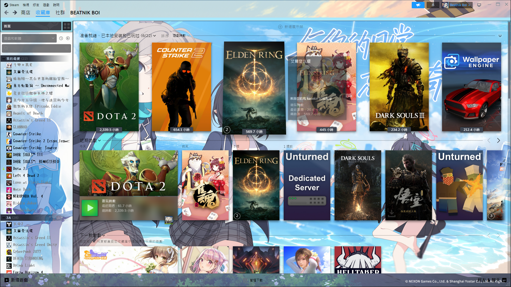
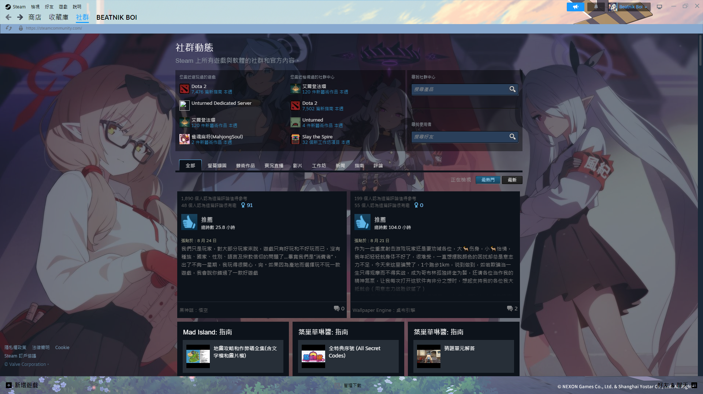
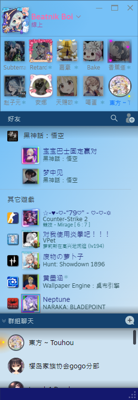
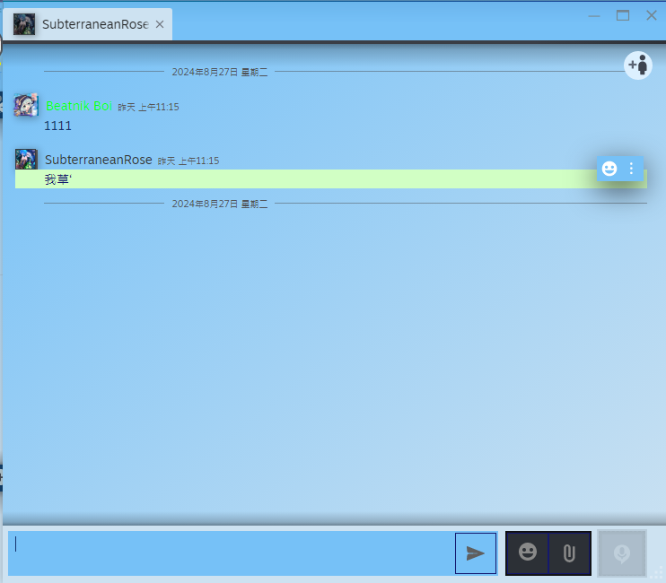
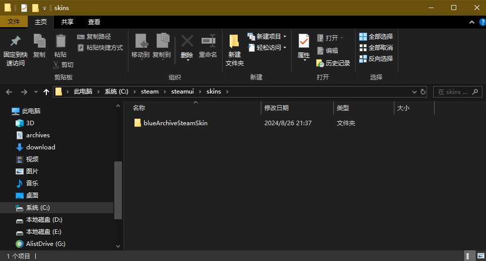
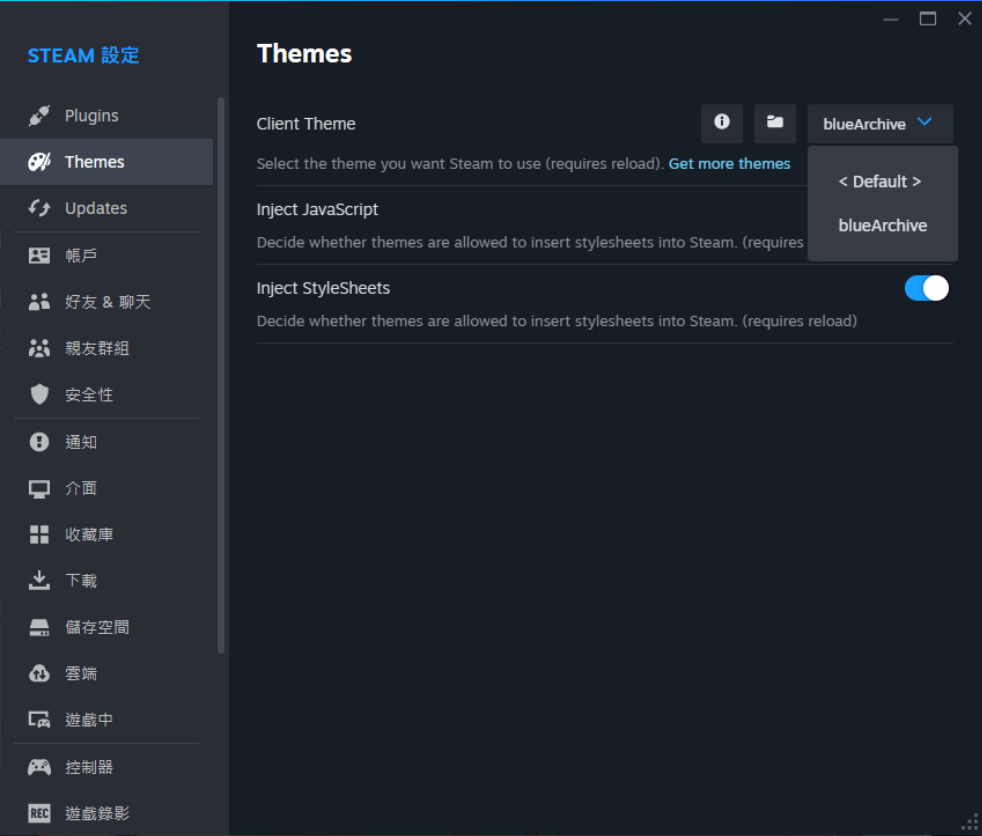

# スチーム用のブルーアーカイブテーマ

[English](./README.md)    [中文](./README.md)

このリポジトリには、Steamクライアント用のカスタム**ブルーアーカイブ**テーマが含まれています。このテーマは、人気ゲーム「ブルーアーカイブ」のビジュアルスタイルをSteamの体験に取り入れ、鮮やかな色、キャラクターアート、独自のデザイン要素を用いてSteamインターフェースの外観を強化します。

*Game page*

  
*Steam Webkit page*

   
*Friends page*  
## インストール

### ステップ1: Millenniumのインストール

このテーマを適用するには、Millenniumをインストールする必要があります。自動インストーラーを使用するか、手動でセットアップすることができます。

1. **自動インストール**: 提供されたインストールスクリプトを使用してオペレーティングシステムにインストールします。
2. **手動インストール**: 必要なファイルを手動でダウンロードし配置する手順に従ってください。

Millenniumのインストールに関する詳細な手順については、[steambrew.app](https://steambrew.app/)をご覧ください。

### ステップ2: ブルーアーカイブテーマのインストール

1. このリポジトリの内容をダウンロードして解凍します。
2. 解凍したフォルダを `steam\steamui\skins` ディレクトリに配置します。

  
*skinsディレクトリにテーマフォルダを配置する例*

3. Steamを開き、「設定」に進みます。
4. 「テーマ」タブに移動して、ブルーアーカイブテーマを選択します。

  
*設定 -> テーマに移動し、ブルーアーカイブテーマを選択*

新しいブルーアーカイブのSteamテーマを楽しんでください！
